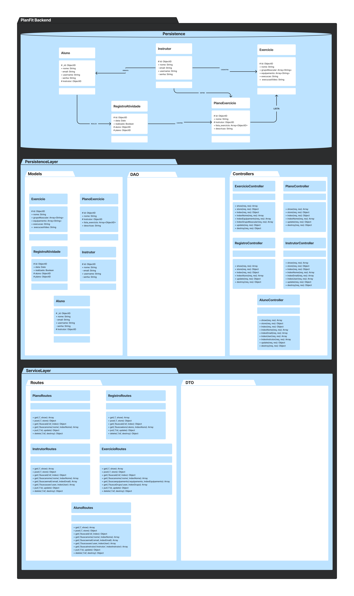
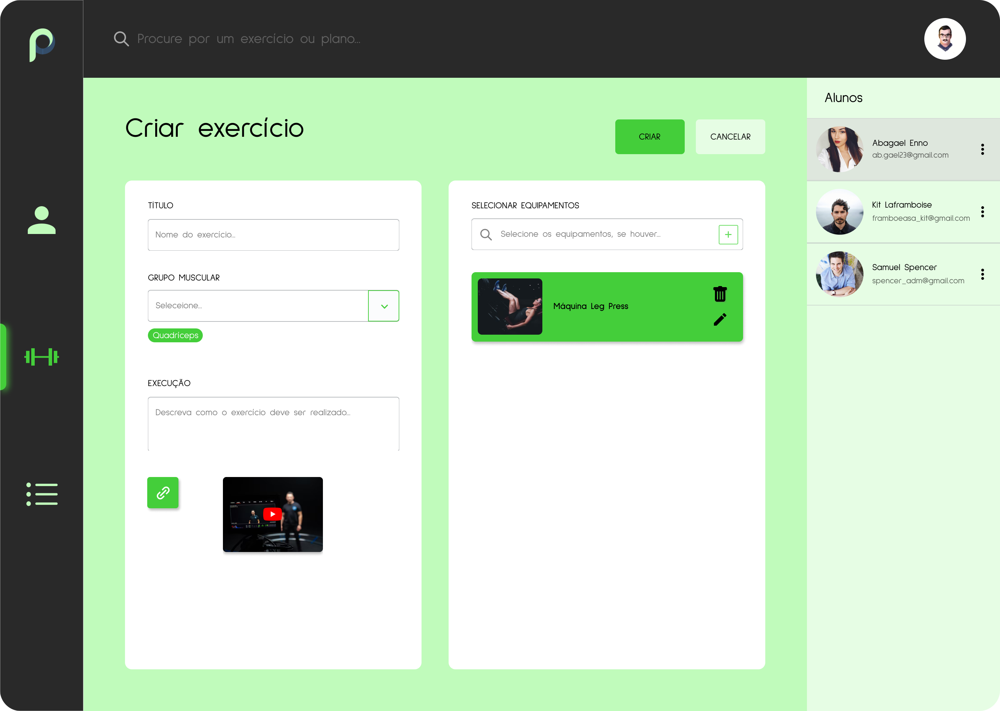
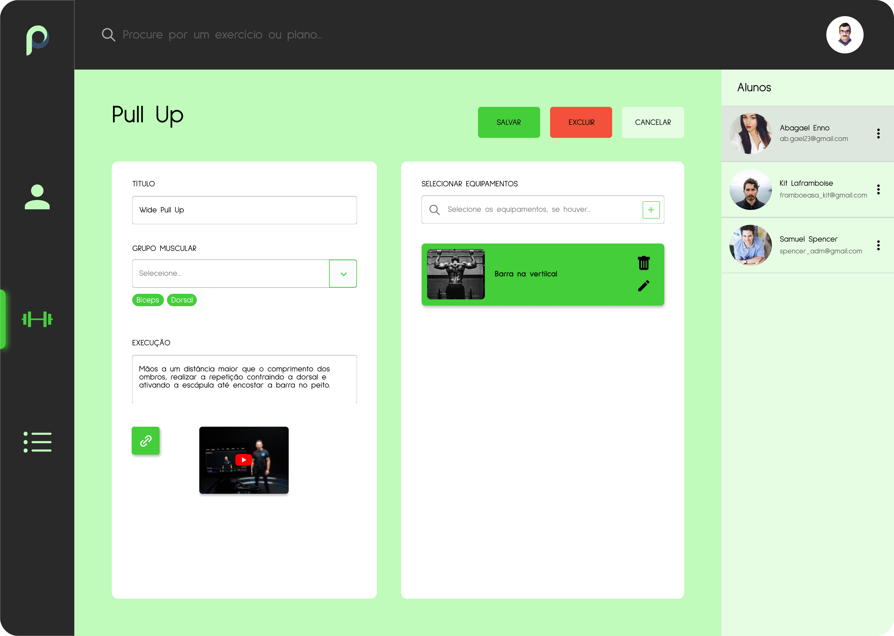
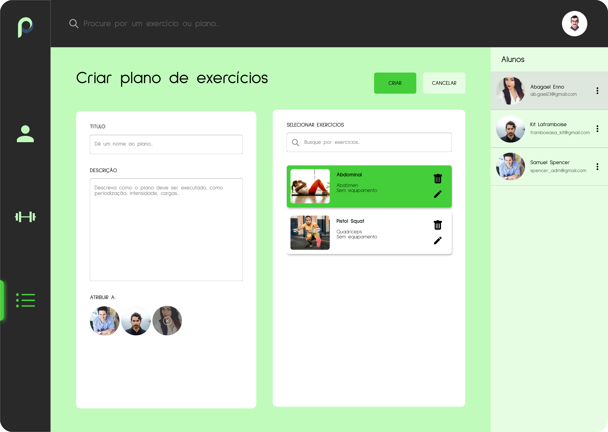
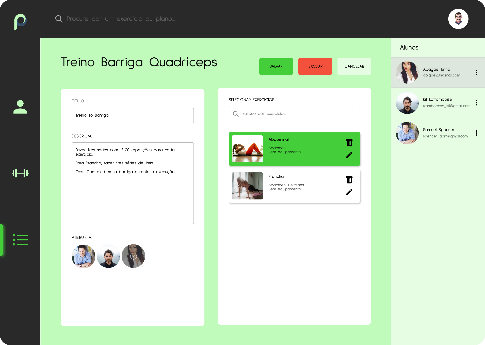
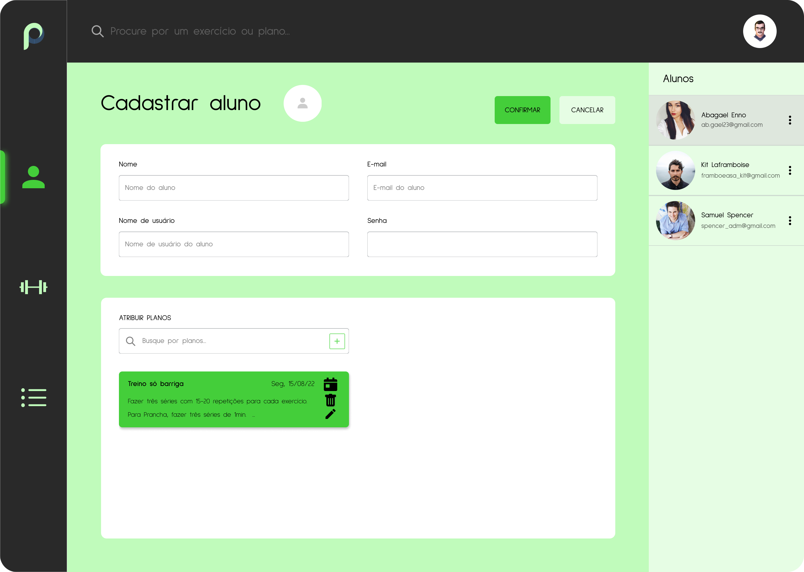
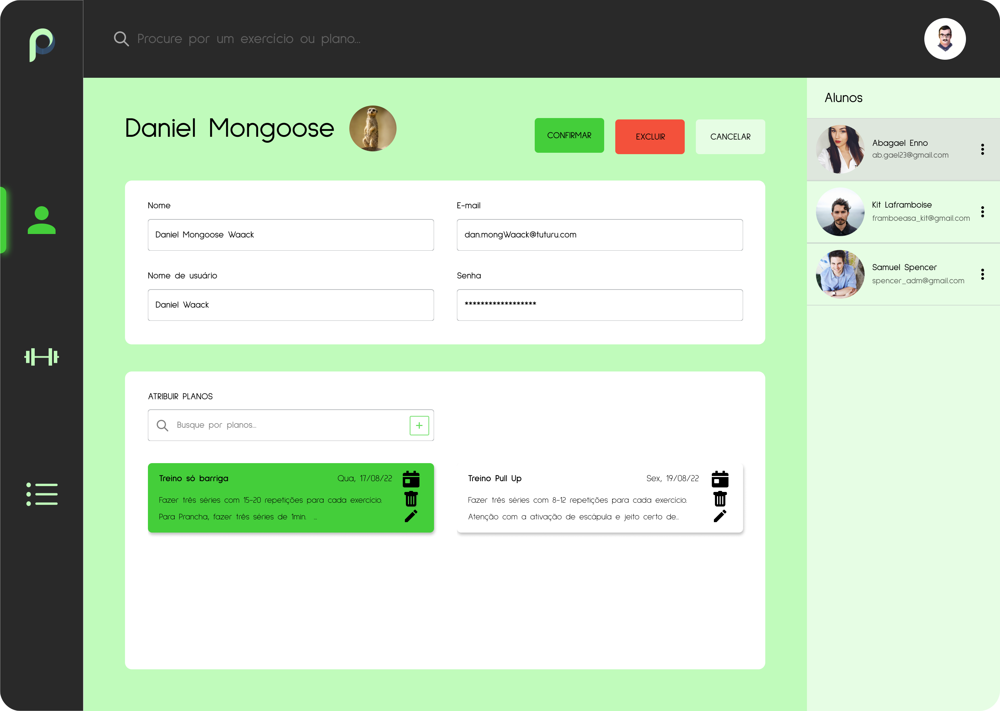

# PlanFit
Aplicação de Desenvolvimento Web Moderno (DWM) para auxiliar instrutores ou personais a fazerem a gestão de programas de treinos e seus alunos.

## Projeto

O projeto está sendo desenvolvido em uma arquiterura cliente-servidor. O lado servidor é uma API RESTful que fornece os dados e define as regras de negócio da aplicação, enquanto o lado cliente é uma página de acesso e visualização que consome os dados do lado servidor.

O backend segue um padrão de arquitetura MVC (*Model-View-Controller*), organizando o código em três camadas distintas. Segue a modelagem:



O frontend ainda está em fase de prototipação e em desenvolvimento de algumas páginas. Dentre as telas disponíveis, segue abaixo os designs feitos até então:

 - Cadastro de exercício



 - Edição de exercício



 - Cadastro de plano



 - Edição de plano



 - Cadastro de aluno



 - Edição de aluno



 - Perfil do instrutor


## Instalação

Para executar a aplicação localmente, faça o clone do repositório, altere a URL de conexão ao mongoDB e execute os comandos no console:

```bash
npm install
npm start
```

**Obs.:** É importante verificar se o npm está instalado na sua máquina!

## Info

### Ferramentas e Tecnologias

 - Backend

 


 - Frontend

### License
[MIT](https://choosealicense.com/licenses/mit/)
