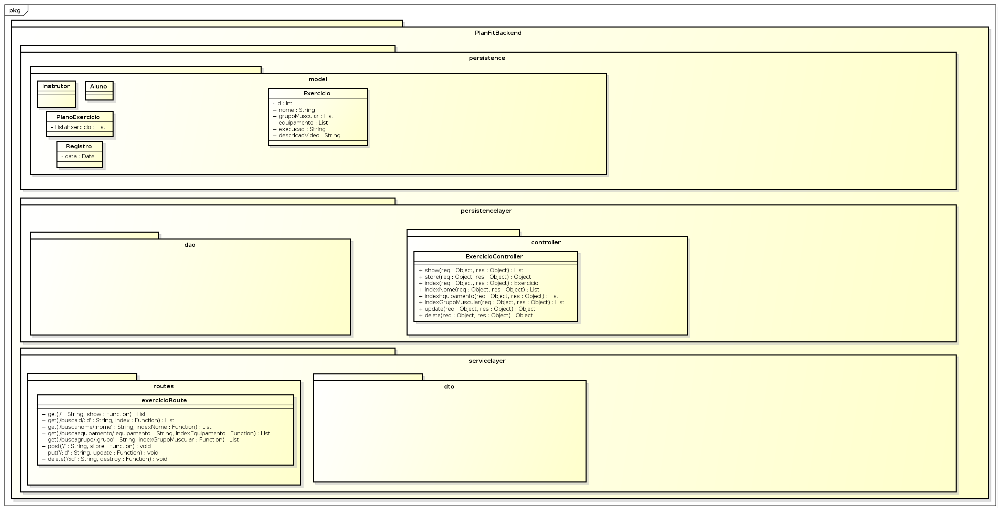

# PlanFit
Aplicação de Desenvolvimento Web Moderno (DWM) para auxiliar instrutores ou personais a fazerem a gestão de programas de treinos e seus alunos.

## Projeto

O projeto está sendo desenvolvido em uma arquiterura cliente-servidor. O lado servidor é uma API RESTful que fornece os dados e define as regras de negócio da aplicação, enquanto o lado cliente é uma página de acesso e visualização que consome os dados do lado servidor.

O backend segue um padrão de arquitetura MVC (*Model-View-Controller*), organizando o código em três camadas distintas. Segue a modelagem:

O frontend ainda está em fase de prototipação.

## Info

### Ferramentas e Tecnologias

 - Backend

 

 - Frontend

### License
[MIT](https://choosealicense.com/licenses/mit/)
